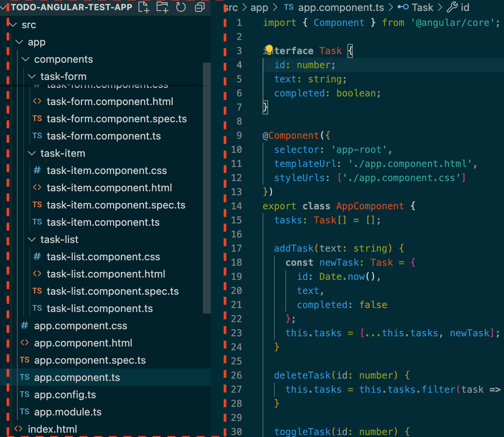
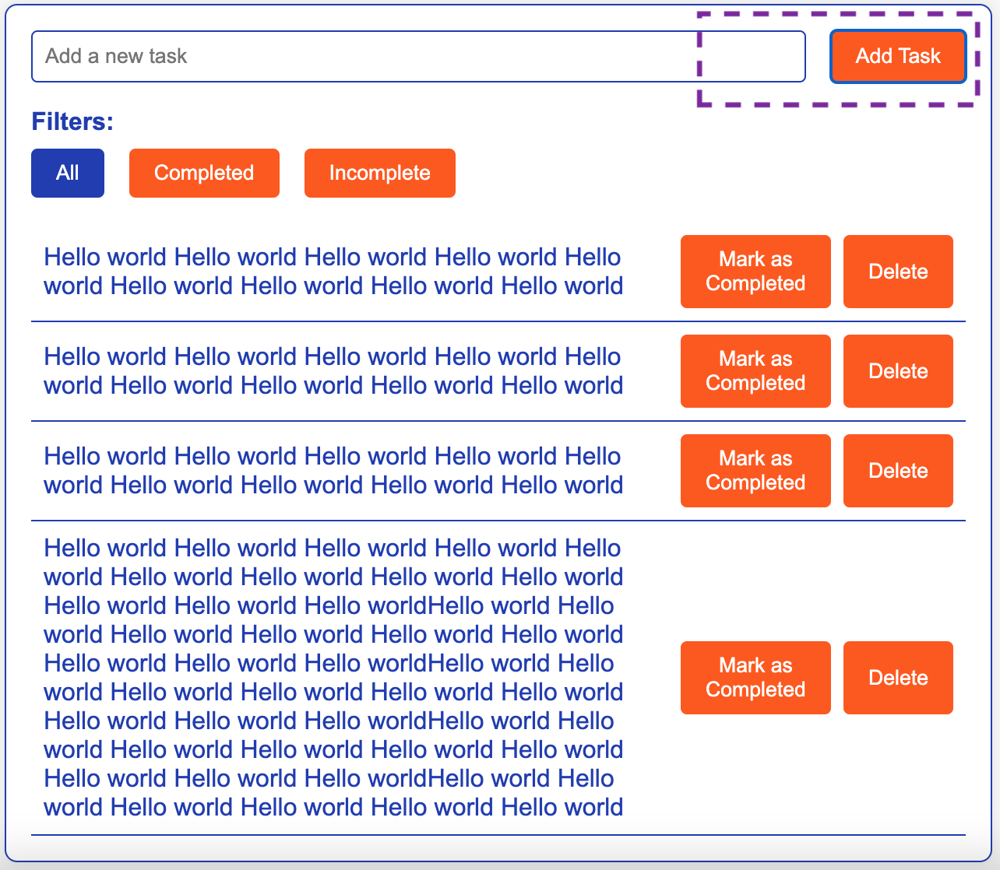
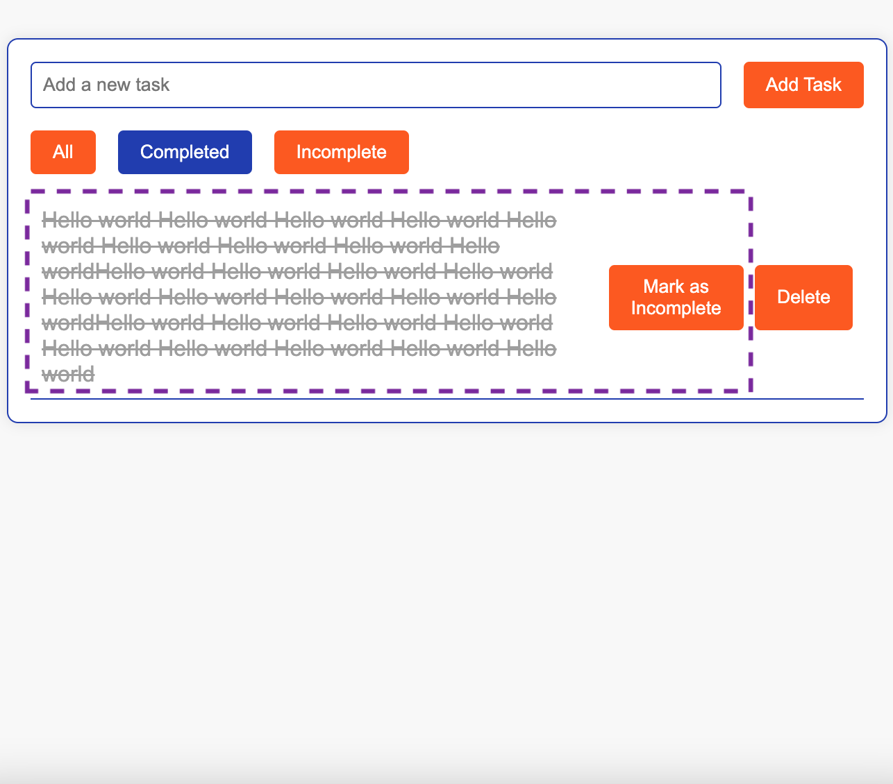
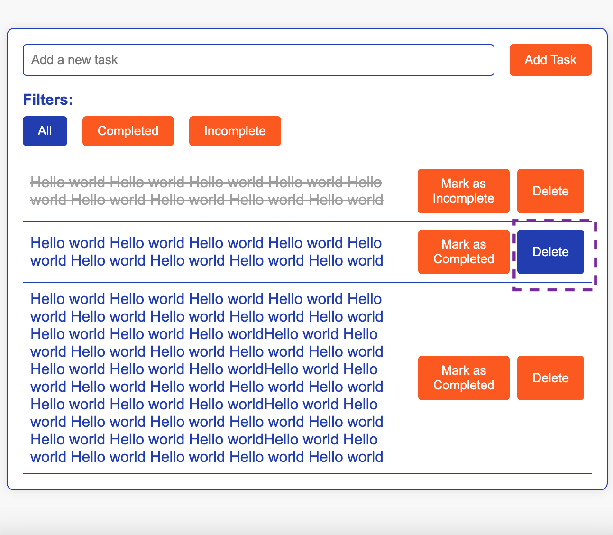
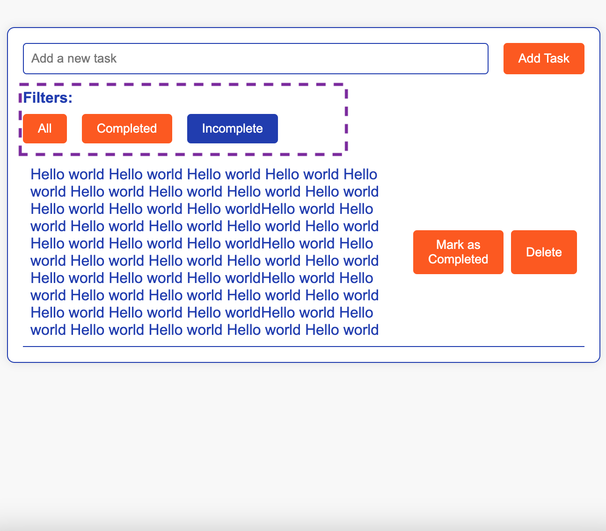

# To-Do List Application

## Stack Used

- Angular
- TypeScript
- Forms

## Main Task

Implement an interface for the To-Do list with the following components:

- Form for adding a new task.
- Input field for the task text.
- Button "Add Task".
- Task list.
- Each task displays text and two buttons: "Delete" and "Mark as completed".
- Task filter.
- Buttons to show all tasks, only completed tasks, and only incomplete tasks.

## Initialization

1. Clone the repository.
2. Navigate to the project directory.
3. Run `npm install` to install dependencies.
4. Run `ng serve` to start the development server.

## Structure

### Component Structure

To-Do List App
│
├── src/
│   ├── app/
│   │   ├── components/
│   │   │   ├── task-form/
│   │   │   │   ├── task-form.component.html
│   │   │   │   ├── task-form.component.css
│   │   │   │   └── task-form.component.ts
│   │   │   ├── task-list/
│   │   │   │   ├── task-list.component.html
│   │   │   │   ├── task-list.component.css
│   │   │   │   └── task-list.component.ts
│   │   │   └── task-item/
│   │   │       ├── task-item.component.html
│   │   │       ├── task-item.component.css
│   │   │       └── task-item.component.ts
│   │   ├── app.component.html
│   │   ├── app.component.css
│   │   ├── app.component.ts
│   │   └── app.module.ts
│   └── assets/
│       └── images/
│           └── structure.png
└── README.md

### Image of the Structure

## Functionality

<table>
  <tr>
    <td style="width: 33%;">
      <h3>Adding a Task</h3>
      <ol>
        <li><strong>Enter Task Text:</strong> Type the task text into the input field.</li>
        <li><strong>Click "Add Task":</strong> Click the "Add Task" button to add the task to the list.</li>
      </ol>
    </td>
    <td style="width: 67%;">
      
    </td>
    <td style="width: 33%;">
      <h3>Marking a Task as Completed</h3>
      <ol>
        <li><strong>Click "Mark as Completed":</strong> Click the "Mark as Completed" button next to the task you want to mark as completed.</li>
      </ol>
    </td>
    <td style="width: 67%;">
      
    </td>
  </tr>
  <tr>
    <td style="width: 33%;">
      <h3>Deleting a Task</h3>
      <ol>
        <li><strong>Click "Delete":</strong> Click the "Delete" button next to the task you want to delete.</li>
      </ol>
    </td>
    <td style="width: 67%;">
      
    </td>
    <td style="width: 33%;">
      <h3>Filtering Tasks</h3>
      <ol>
        <li><strong>Show All Tasks:</strong> Click the "All" button to display all tasks.</li>
        <li><strong>Show Completed Tasks:</strong> Click the "Completed" button to display only completed tasks.</li>
        <li><strong>Show Incomplete Tasks:</strong> Click the "Incomplete" button to display only incomplete tasks.</li>
      </ol>
    </td>
    <td style="width: 67%;">
      
    </td>
  </tr>
</table>

## Author

Author: [Olexandra Kunytska](https://github.com/olexandracodes)
